# Drone Detection with YOLO v3

This exercise was completed in preparation for the Deep Learning course at [University of Zanjan](https://www.znu.ac.ir/en) in 2021.

---

Since it was decided to detect the drone using the tiny YOLO model, a search was made on the Internet. Several projects in this field are available and based on which source is newer and less complex and its annotation input file is in text form, one of them was selected at the address below.

https://github.com/qqwweee/keras-yolo3

In this source code, YOLO v3 and also tiny YOLO version have been implemented to recognize 80 different classes. First, the files of this project will be briefly introduced.

__coco_classes.txt__ : in this file, labels of 80 classes are stored.

__tiny_yolo_anchors.txt__: The width and height values for 6 different anchor numbers for the tiny model are given in this file, each anchor has its own w and h values.

__yolov3-tiny.cfg__: In this file, the configuration of the convolution and pooling layers and the tiny yolo model in general are given.

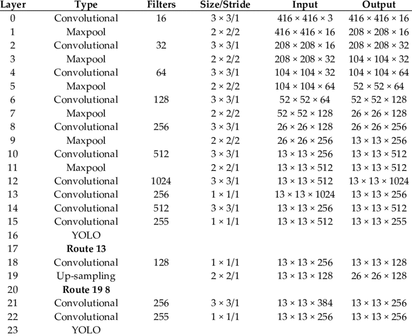

__convert.py__: This program is designed to create .h5 files of yolo v3 or tiny yolo v3 based on the config file and pre-trained weights.

__yolo_video.py__: This uses the created model to recognize the objects in the image or video based on the trained classes.

__train.py__: This trains the .h5 file model yolo v3 or tiny yolo v3

__yolo.py__ : meta data

### Annotation file prepartion
3000 drone images are given for this project. In this dataset, there is a .txt file for each .jpg file including bounding box information (a,y,w,h)
So I wrote a python code to get the .jpg and .txt files along with a percent number, and returns two annotation files : 
- drone_annots_train.txt
- drone_annots_test.txt

for example, one row of these files is like below:
```
E:/Projects/keras-yolo3-master/Dataset/1387.jpg 687,710,826,797,0
Image file path and name, x1, y1, x2, y2, 0
```
0 means class number, in this task, we have only one class, so we'll have 0 for all the data.

__Point1__: during annotation files creation, 55 files were removed because of minus coordination.

__Point2__: For some images, in the corresponding text file, more than one bounding box was specified while there was only one drone object in the image, so after randomly checking such files, it was found that the last bounding box is always correct. Therefore, when generating the annotation file, only the last bounding box was considered for each image.

__Point3__: with respect to the size of the image used in the tiny yolo v3 model is 416*416, so, images with larger dimensions were not used in the annotation file generation.

## using Data Augmentation

Considering that the number of files in the drone dataset is small (3000), in order to prevent overfitting, the augmentation method was used to generate new images from the existing images with mechanisms such as rotation, adding noise to the image, etc. Such images were used in the final stages of Train model. In the first stage, more than 10,000 images and in the second stage, more than 17,000 images were produced and used.

This written python code is available on augment_data.py and sequence.py. I used augment_images() and augment_bounding_boxes () from imgaug library.

This program uses the annotation files created in the previous step (drone_annots_train.txt, drone_annots_test.txt files) and then creates new images in the augdat path of the project and the new annotation file for these images in the project path with the names drone_annots_train.txt , creates drone_augdat_annots_train.txt.

Below is an example of the original image and the new image created based on it:

main image:  
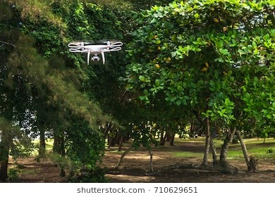

augmented images: 

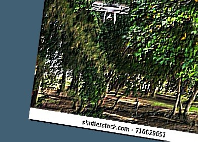 
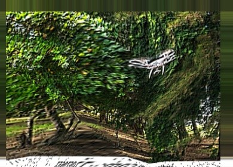

## Tiny YOLO v3 Model Creation

First, the pre-trained weights related to the tiny yolo v3 model were downloaded from the yolo site (https://pjreddie.com/darknet/yolo) and copied in the project path: (yolov3-tiny.weights file)
Then, considering that the default tiny yolo v3 network has 24 layers and 80 classes can be recognized, it is necessary to edit the yolov3-tiny.cfg file in order to recognize only one class.

- It was changed from classes=80 to classes=1
- Changed the last [convolutional] layer before the Yolo layer from 255 to 18 (filters=18). 

In yolo, by default, 3 anchor numbers are considered for each cell. Therefore, assuming 80 classes and 5 values (x, y, w, h, pc) for each Bounding Box, we have in the output layer: 

255 = 3 * (80 + 5)

And for one class, we have:

18 = 3 * (1 + 5)

Now, we can run convert.py
```
python convert.py  yolov3-tiny.cfg  yolov3-tiny.weights  model_data/tiny_yolo_weights.h5
```

## Tiny YOLO v3 Model Training

At this step, at first drone_class.txt file was created.
In the next step, multiple executions were performed every time by changing the number of epochs for the train phase of the last two layers of the network and freezing the rest and changing the epoch for the second phase, which is to train all the layers. 

For using the trained model, we run:
```
python yolo_video.py --image
```

Below are some examples of the output of the trained model:

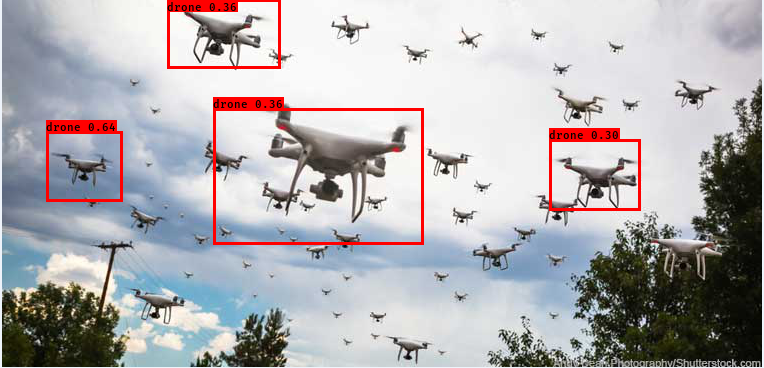
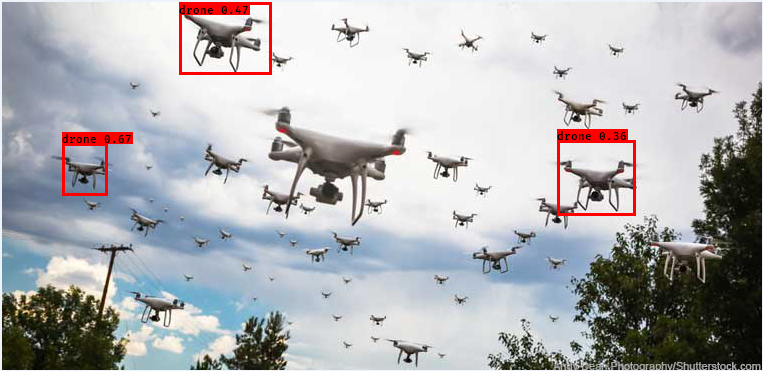
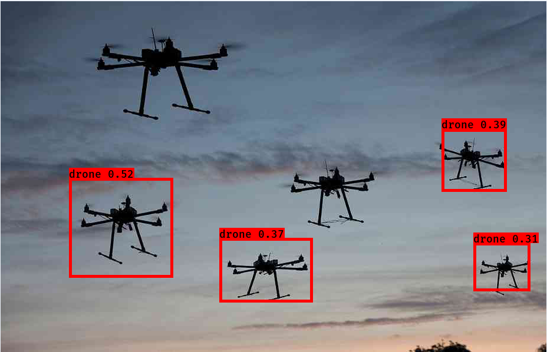
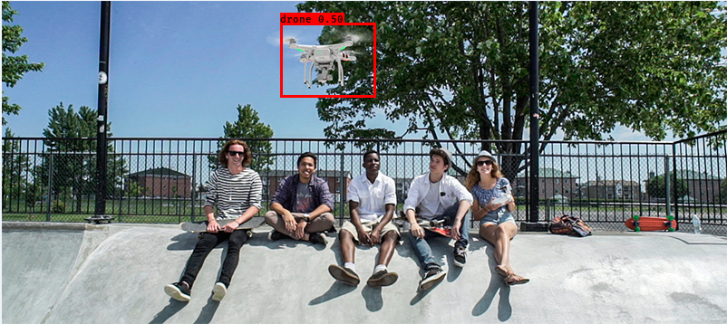
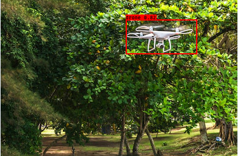
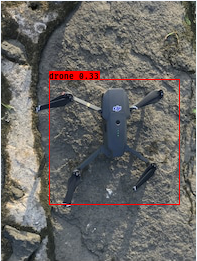
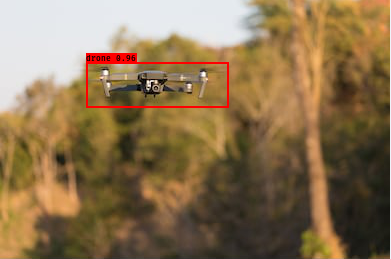
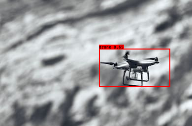


